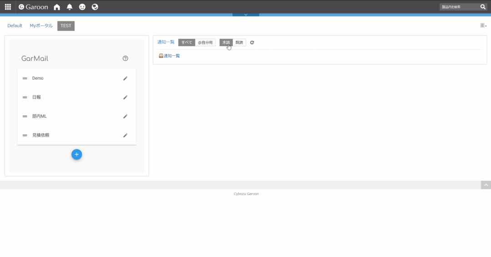

<!--  -->

# GarMail

## デモ

## インストール

1. 下のXMLファイルを保存
[HTMLポートレット](./res/html_portlet.xml)
2. Garoon個人設定からHTMLポートレットの読み込み
3. ポータルに追加

## 使いかた

編集ボタンでテンプレート作成、クリックで送信

### 項目

to: 宛先
cc: CC
subject: 表題
body: 本文

### テンプレート置換機能

表題と本文では、以下の文字は送信確認画面で置き換えられます。

%CLIPBOARD% : クリップボードにコピーしている文字
%LASTNAME% : Garoonの苗字
%NAME% : Garoonのフルネーム
%SIGNATURE% : Garoonの1番目の署名
%TODAY% : 今日の日付(YYYYMMDD)

%SIGNATURE[N]% : GaroonのN番目の署名(e.g. %SIGNATURE[2]%)
%TODAY[FORMAT]% : 指定フォーマットの今日の日付(e.g. %TODAY[YYYY-MM-DD]%)

## データベース

データはブラウザのIndexedDBに保存されます
cookie削除等で初期化されます

## License

MIT License
